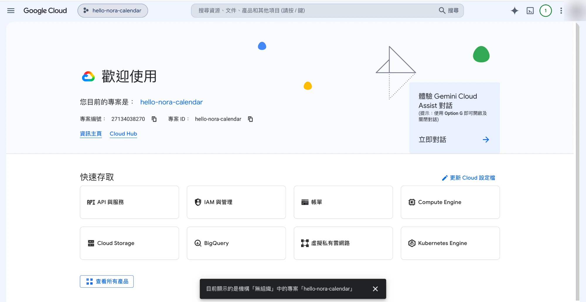
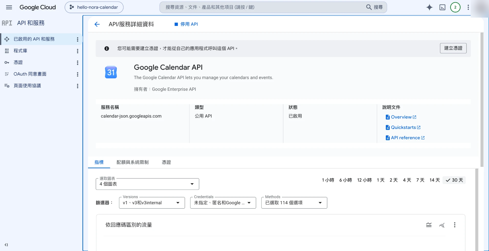
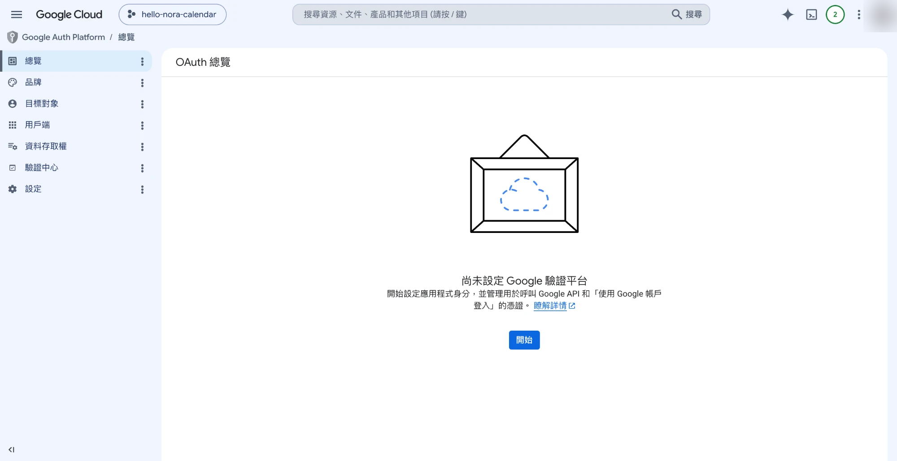
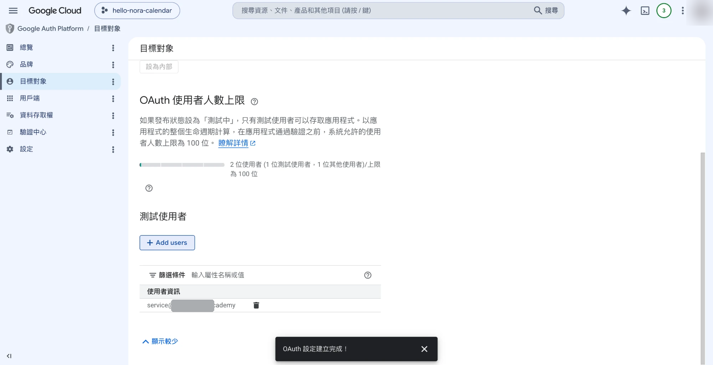
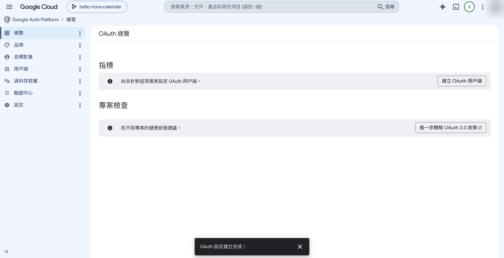

# 進階串接教學：把貼文排程同步到你的 Google 日曆

> 這是**進階、選用**功能。裝好之後，Maya 幫你排完一週貼文，會自動把每一篇的發布時間排進**你自己的 Google 日曆**，你打開手機行事曆就看得到哪天該發什麼。
>
> ⚠️ 老實說，這是整套課裡**最有技術門檻的一段**，大約要花 20–30 分鐘。但只要照著步驟走，不懂程式也做得完。沒時間或暫時用不到的話，**完全可以先跳過**，不影響其他功能。

---

## ① 串好之後會長這樣（先看終點）

裝好、授權完之後，你只要跟團隊說一句話：

```
你：幫我把這週排好的 7 篇貼文排進我的 Google 日曆
Nora → Maya：好，已經幫你把 7 篇貼文的發布時間排進去了 ✅
            週一 10:00、週三 12:00、週五 19:00……都在你的日曆上了，
            到時間日曆會提醒你。
```

然後你打開自己的 Google 日曆（手機或電腦都行），就會看到這 7 篇貼文整整齊齊排在上面，附帶發文時間與內容備註。

---

## 先確認你符合這些條件（前置需求）

開始前先確認三件事，缺一個這個功能就裝不起來：

| 需求 | 說明 |
|------|------|
| **Claude 付費版（Pro 以上）** | 這個功能只有 Claude Code（桌面版、付費版）能用。**免費版（網頁版）做不到**，免費版學員請跳過這段。 |
| **電腦裝了 Node.js** | 連接程式靠它運作。沒裝的話下面第一步會帶你裝。 |
| **一個 Google 帳號** | 就是你平常在用的那個 Gmail / Google 日曆帳號。 |

---

## ② 串接教學（一步一步跟著做）

> 全程分四大段：**裝 Node.js → 去 Google 開金鑰 → 把金鑰接上 Claude → 授權測試**。
> 標 🙋‍♂️ 的是「只有你能親手做」的步驟；標 🤖 的是「可以交給 Claude 幫你跑」的步驟。

### 第一段：裝 Node.js（連接程式的引擎）

> Node.js 是一個免費的小工具，讓那支「連你日曆的程式」能在你電腦上跑。**你完全不用懂它，裝一次就一勞永逸。**

**先別急著下載——先問 Claude 你裝過了沒。** 🤖
很多人電腦其實早就有了。在 Claude Code 對話框跟它說：

> 「幫我看一下我電腦有沒有裝 Node.js」

它會幫你檢查，然後：

- **已經有了** → 太好了，這段直接跳過，往第二段走。
- **還沒有** → 才需要裝，照下面做（只要一次）：🙋‍♂️
  1. 打開瀏覽器，到 [nodejs.org](https://nodejs.org)。
  2. 下載標示 **LTS（長期支援版）** 的那個，一路「下一步」裝完。
  3. 裝完回來跟 Claude 說「幫我確認 Node.js 裝好了沒」，它會再幫你確認一次。🤖

---

### 第二段：去 Google Cloud 開一組「金鑰」🙋‍♂️（這段全程在你自己的 Google 帳號裡，只有你能做）

這段是把「允許這支程式進我日曆」的鑰匙生出來。聽起來嚇人，但其實就是照著點。

> 💬 **過程中會一直看到 API、OAuth 這些英文字——別怕，你完全不用懂它們的意思。** 把它們當成「選單上的一個名字」，照著找、照著點就好，跟它們是什麼意思一點關係都沒有。

1. **開一個專案**
   到 [Google Cloud Console](https://console.cloud.google.com)，用你的 Google 帳號登入。
   點最上方的專案選單 →「新增專案」→ 取個名字（例如 `hello-nora-calendar`）→ 建立。
   建好後記得在最上方把這個專案**選起來**。

   

2. **開啟 Google 日曆 API**
   左上選單 →「API 和服務」→「程式庫」→ 搜尋 `Google Calendar API` → 點進去 →「啟用」。

   

3. **設定驗證平台 ＋ 把自己加成測試者**
   左邊點「**OAuth 同意畫面**」，會進到「**Google Auth Platform**」→ 按藍色「**開始 / Get started**」，照精靈填：
   - *應用程式名稱*：隨意（例如 `Hello Nora`）；*使用者支援電子郵件*：選你的 Gmail → 下一步
   - *目標對象*：選「**外部 (External)**」 → 下一步
   - *聯絡資訊*：填你的 Gmail → 勾同意政策 → 建立

   建立完，左邊點「**目標對象 (Audience)**」→ 在「**測試使用者**」按「**+ Add users / 新增使用者**」→ 把**你自己的 Gmail 加進去** → 儲存。
   > ⚠️ 這個測試使用者的 email，**必須跟你等一下要授權的帳號一樣**（也就是貼文要排進去的那本日曆的帳號），不然授權會被擋。

   

   

4. **建立金鑰（OAuth 用戶端）**
   左邊點「**用戶端 (Clients)**」→「**建立用戶端 / Create client**」。
   - *應用程式類型*：**一定要選「桌面應用程式 (Desktop app)」**（選錯後面會連不上，務必看清楚）。
   - 名稱隨意 → 建立。
   - 跳出的視窗按「**下載 JSON / Download JSON**」，把金鑰檔存下來。
   > 🔒 那個視窗會顯示一串「用戶端密鑰」——**別截圖外傳、別貼給任何人**，你只需要按「下載 JSON」拿到那個檔就好。

   

5. **把金鑰檔放好**
   把剛下載的檔案搬到一個你**找得到、不會手滑刪掉**的地方就好（例如「文件」資料夾，或專門開一個資料夾放它）。
   下一步會用到「這個檔案在哪」，但你**不用自己背那串路徑**——最簡單的做法是直接把檔案拖進 Claude Code 對話框，請它幫你抓出位置。🤖

---

### 第三段：把金鑰接上 Claude 🤖（這段交給 Claude 幫你跑）

**最簡單的做法——把金鑰檔拖進 Claude Code 對話框，跟它說：**

> 「幫我把這個金鑰檔接成 Google 日曆連線」

Claude 會自動把該填的東西組好、幫你接上，你什麼都不用打。

接好後，**完全關閉 Claude Code 再重開一次**，讓它讀到新連線。

<details>
<summary>想自己手動接？（進階，可不看）</summary>

把下面這行貼給 Claude，**把引號裡的路徑換成你金鑰檔的位置**：

```
claude mcp add google-calendar --env GOOGLE_OAUTH_CREDENTIALS="你的金鑰檔路徑" -- npx -y @cocal/google-calendar-mcp
```

例如：
```
claude mcp add google-calendar --env GOOGLE_OAUTH_CREDENTIALS="/Users/你的名字/Documents/gcp-oauth.keys.json" -- npx -y @cocal/google-calendar-mcp
```
</details>

---

### 第四段：第一次授權 + 測試 🙋‍♂️🤖

1. 重開後，跟 Claude 說：「**幫我授權 Google 日曆**」。🤖 它會打開一個瀏覽器授權頁。
2. 在瀏覽器裡：🙋‍♂️
   - **選你剛剛加成「測試使用者」的那個帳號**登入（一定要同一個，選錯會被擋）。
   - 會跳「**Google 尚未驗證這個應用程式**」的警告——**這是正常的**（因為這是你自己開的私人金鑰，不是上架的公開 App）。點左下「**進階 / Advanced**」→「**前往 …（不安全）/ Go to … (unsafe)**」。
   - 權限頁按「**繼續 / 允許**」。
   - 看到「**Account connected! / 已連接**」就完成了，可以關掉視窗。
3. 回到 Claude Code，跟它說「**幫我在日曆上建一個明天下午 3 點的測試事件**」。🤖
4. 打開你的 Google 日曆，明天下午 3 點有看到那個事件，就**大功告成** ✅（確認後可以把測試事件刪掉）。

---

### 第五段（強烈建議）：發布應用程式，免得每 7 天就壞一次 🙋‍♂️

> ⚠️ **這步別跳過，否則「用幾天突然失效」幾乎一定會發生。** 在「測試模式」下，剛剛的授權**每 7 天會自動過期一次**——這是 Google 的預設行為、不是壞掉，但每週都要重接很煩。做完下面這步就一勞永逸：

1. 回 [Google Cloud Console](https://console.cloud.google.com)，左邊點「**OAuth 同意畫面 / Google Auth Platform**」。
2. 找到「**發布應用程式 / Publish app**」按鈕，按下去、確認發布（狀態會從「測試」變「正式版 / In production」）。
3. 之後就**不會再每 7 天過期**。唯一差別：哪天重新授權時，還是會看到「Google 尚未驗證」的警告——**那個無害，點「進階 → 繼續」就好**（因為這是你自己開的私人金鑰，你是在授權給你自己）。

> 💡 如果你就是只想用 7 天、之後再說，也可以跳過這步——過期了再跟 Claude 說「**重新授權 Google 日曆**」點一次允許即可。但長期要用，**強烈建議現在就發布，省得每週被打斷。**

---

## ③ 動手前一定要知道的幾件事（警示條）

> 這些不是嚇你，是先講清楚，免得你之後遇到以為是壞掉。

- ⚠️ **只有 Claude 付費版能用。** 免費版（網頁版）沒有這個功能，這段請跳過。

- ⚠️ **「7 天後失效」是預設行為，不是壞掉。** 金鑰在「測試模式」下，授權每 7 天會過期一次，過期就再授權一次即可。
  想一勞永逸的話：回 Google Cloud →「OAuth 同意畫面」→ 按「**發布應用程式**」，之後就不會每 7 天過期。但按了之後，每次授權會看到上面說的「未驗證」警告——**那個警告無害，點進階繼續就好**。

- ⚠️ **「未驗證」警告是正常的。** 因為你連的是自己開的私人金鑰，不是 App Store 那種審核過的公開程式。你是在授權給「你自己」，安全。

- 🔒 **金鑰檔等於一把鑰匙，要顧好。** 那個 JSON 檔能存取你的日曆，請：
  - 只留在自己電腦那一份，**不要貼到群組、不要截圖外傳**。
  - **不要放進會公開分享的雲端資料夾**。
  - 哪天電腦要送修或不用了，回 Google Cloud 把那組金鑰刪掉就能一鍵作廢。

- ⚠️ **Windows 學員注意：** 路徑寫法跟 Mac 不同（Mac 是 `/Users/...`，Windows 是 `C:\Users\...`）。不確定就把金鑰檔拖進 Claude Code 請它幫你抓正確路徑。

---

## 卡關了？常見狀況排錯

| 狀況 | 多半是因為 | 怎麼解 |
|------|-----------|--------|
| 指令報錯、找不到 `npx` | Node.js 沒裝好 | 回第一段重裝 Node.js LTS，裝完重開 Claude Code |
| 授權時一直無法繼續 | 測試者剛加還沒生效 | 等 2–3 分鐘再試一次 |
| 連不上、權限不足 | 金鑰類型選錯（沒選「桌面應用程式」） | 回第二段第 4 步重新建立一組「桌面應用程式」金鑰 |
| 用了幾天突然失效 | 7 天 token 過期（正常） | 跟 Claude 說「重新授權 Google 日曆」再點一次允許；或回去「發布應用程式」 |

> 還是卡住？先把錯誤訊息丟給你的 Claude 試試；不行就加官方 LINE [@eleanorfilmacademy](https://eleanorfilmacademy.tw/k0AWB) 或來信 service@eleanorfilm.academy，附上錯誤畫面截圖，我們會協助你。
